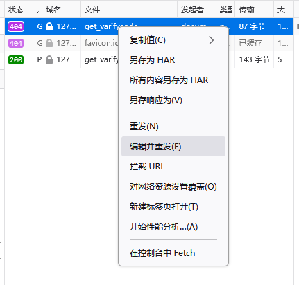
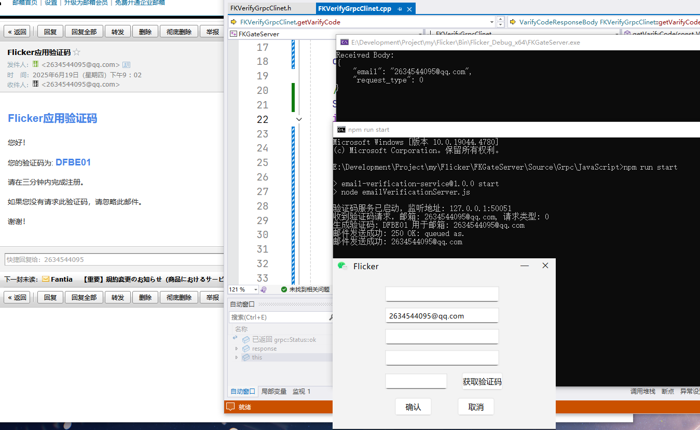
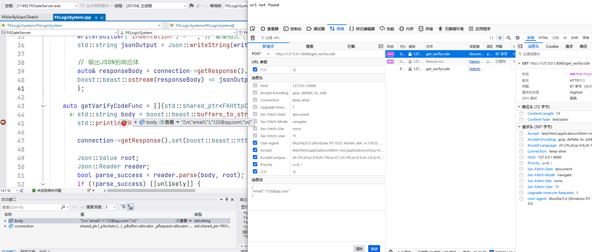
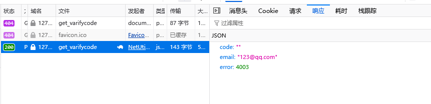
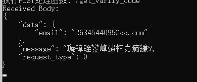
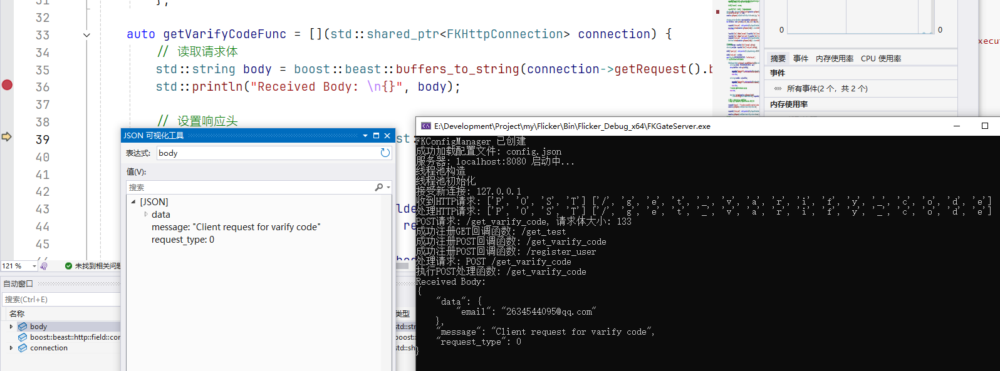

# 项目说明

* NexUs
* NexUsExample
* Flicker
* FKGateServer


NexUs和NexUsExample是开源项目[ElaWidgetsTool](https://github.com/Liniyous/ElaWidgetTools)自定义模块主要用来给<u>Flicker客户端</u>进行UI设计实现

Flicker客户端

FKGateServer服务器进行处理客户端发送的消息

# 开发记录

## 1. 项目架构

`FKLoginWidget` 是客户端登录UI并负责处理业务，`FKHttpManager`将客户端 点击控件 产生的请求 发送封装的JSON消息 给`FKGateServer`服务器，服务器则是通过`boost`和`grpc`进行处理请求并响应，具体为`FKServer`监听端口，`async_accept`收到请求后通过`FKHttpConnection`作为一个通道`async_read`请求后，将具体业务处理交给`FKLogicSystem`单例类回调我们提供的已经注册的业务方法，最后`FKHttpConnection`将响应处理的消息交给客户端解析处理，展示给用户

## 2. 测试记录

打开服务器我们进行post测试



6/19日提交测试







## 3. TODO

```
登录失败五次后锁定账号1个小时不能登录

重置密码，需要传入username、email来进行判断是否存在用户，存在就重置密码，qt发送数据，服务器进行判断

忘记密码，初始给用户名或者邮箱，一个验证码lineedit，验证成功之后切换页面输入密码进行修改输入密码页面5分钟有效（可以根据邮箱验证码有效实际？）

qt错误信息switch处理
日志系统
优化数据库连接池，智能指针和调用逻辑
```

## 4. 问题记录

### shared_ptr管理的单例

```cpp
#define SINGLETON_CREATE_SHARED_H(Class)          \
private:                                            \
    static std::shared_ptr<Class> _instance;        \
    friend struct std::default_delete<Class>;       \
public:                                             \
    static std::shared_ptr<Class> getInstance();

#define SINGLETON_CREATE_SHARED_CPP(Class)        \
    std::shared_ptr<Class> Class::_instance = nullptr; \
    std::shared_ptr<Class> Class::getInstance()     \
    {                                               \
        static std::once_flag flag;                 \
        std::call_once(flag, [&]() {                \
            _instance = std::shared_ptr<Class>(new Class());   \
        });                                         \
        return _instance;                           \
    } 

// .h
class FKLogicSystem {
	SINGLETON_CREATE_SHARED_H(FKLogicSystem)
private:
	FKLogicSystem();
	~FKLogicSystem() = default;
};

// .cpp
SINGLETON_CREATE_SHARED_CPP(FKLogicSystem)
/* 宏展开
std::shared_ptr<FKLogicSystem> FKLogicSystem::_instance = nullptr;
std::shared_ptr<FKLogicSystem> FKLogicSystem::getInstance() {
	static std::once_flag flag;
    std::call_once(flag, [&]() {
    _instance = std::shared_ptr<FKLogicSystem>(new FKLogicSystem());
    });
    return _instance;
}
*/
MSVC编译器报错
没有与参数列表匹配的构造函数 "std::shared_ptr<_Ty>::shared_ptr [其中 _Ty=FKLogicSystem]" 实例参数类型为FKLogicSystem*；
    
如果将 ~FKLogicSystem() = default; 设置为 public 就没有问题， 推测是shared_ptr访问不到析构函数，即使设置了friend struct std::default_delete<Class>;也没用
    
    
// 修复，手动指定析构
#define SINGLETON_CREATE_SHARED_H(Class)          \
private:                                            \
    static std::shared_ptr<Class> _instance;        \
public:                                             \
    static std::shared_ptr<Class> getInstance();

#define SINGLETON_CREATE_SHARED_CPP(Class)        \
    std::shared_ptr<Class> Class::_instance = nullptr; \
    std::shared_ptr<Class> Class::getInstance()     \
    {                                               \
        static std::once_flag flag;                 \
        std::call_once(flag, [&]() {                \
            _instance = std::shared_ptr<Class>(new Class(), [](Class* ptr) { delete ptr; });   \
        });                                         \
        return _instance;                           \
    } 
或者
#define SINGLETON_CREATE_SHARED_H(Class)                    \
private:                                                    \
    static std::shared_ptr<Class> _instance;                \
    friend std::default_delete<Class>;                      \
    template<typename... Args>                              \
    static std::shared_ptr<Class> _create(Args&&... args) { \
        struct make_shared_helper : public Class            \
        {                                                   \
            make_shared_helper(Args&&... a) : Class(std::forward<Args>(a)...){}     \
        };                                                  \
        return std::make_shared<make_shared_helper>(std::forward<Args>(args)...);   \
    }                                                       \
public:                                                     \
    static std::shared_ptr<Class> getInstance();

// std::shared_ptr<Class>(new Class(), [](Class* ptr) { delete ptr; });   
#define SINGLETON_CREATE_SHARED_CPP(Class)          \
    std::shared_ptr<Class> Class::_instance = nullptr; \
    std::shared_ptr<Class> Class::getInstance()     \
    {                                               \
        static std::once_flag flag;                 \
        std::call_once(flag, [&]() {                \
            _instance = _create();                  \
        });                                         \
        return _instance;                           \
    } 
```

### redis测试

redis是C语言写的，如果使用std::string，即使密码正确`redisReply* r = (redisReply*)redisCommand(c, "auth %s", redis_password);`仍会得到的是响应错误，

原因分析：

1. 在C++中，`std::string`类型**并不是以空字符('\0')结尾的字符串**（虽然实际上C++11标准保证std::string内部存储是连续的，并且可以通过c_str()获取空字符结尾的字符串）。但是，`redisCommand`函数是一个可变参数函数，类似于`printf`，它期望一个格式字符串和一系列参数。当使用`%s`格式说明符时，它期望一个**以空字符结尾的字符串（即C风格字符串）**。

```C
void TestRedis() {
	// 连接 Redis
	redisContext* c = redisConnect("127.0.0.1", 6379);
	if (c->err) {
		std::cerr << "Connect to redisServer failed: " << c->errstr << std::endl;
		redisFree(c);
		return;
	}
	std::cout << "Connect to redisServer Success" << std::endl;

	// 修复点：使用 c_str() 转换
	std::string redis_password = "123456";
	redisReply* r = (redisReply*)redisCommand(c, "auth %s", redis_password.c_str());

	if (!r) {
		std::cerr << "Redis authentication command failed" << std::endl;
		redisFree(c);
		return;
	}

	if (r->type == REDIS_REPLY_ERROR) {
		std::cerr << "Redis认证失败: " << r->str << std::endl;
	}
	else {
		std::cout << "Redis认证成功" << std::endl;
	}
	freeReplyObject(r);

	//为redis设置key
	const char* command1 = "set stest1 value1";

	//执行redis命令行
	r = (redisReply*)redisCommand(c, command1);

	//如果返回NULL则说明执行失败
	if (NULL == r)
	{
		printf("Execut command1 failure\n");
		redisFree(c);        return;
	}

	//如果执行失败则释放连接
	if (!(r->type == REDIS_REPLY_STATUS && (strcmp(r->str, "OK") == 0 || strcmp(r->str, "ok") == 0)))
	{
		printf("Failed to execute command[%s]\n", command1);
		freeReplyObject(r);
		redisFree(c);        return;
	}

	//执行成功 释放redisCommand执行后返回的redisReply所占用的内存
	freeReplyObject(r);
	printf("Succeed to execute command[%s]\n", command1);

	const char* command2 = "strlen stest1";
	r = (redisReply*)redisCommand(c, command2);

	//如果返回类型不是整形 则释放连接
	if (r->type != REDIS_REPLY_INTEGER)
	{
		printf("Failed to execute command[%s]\n", command2);
		freeReplyObject(r);
		redisFree(c);        return;
	}

	//获取字符串长度
	int length = r->integer;
	freeReplyObject(r);
	printf("The length of 'stest1' is %d.\n", length);
	printf("Succeed to execute command[%s]\n", command2);

	//获取redis键值对信息
	const char* command3 = "get stest1";
	r = (redisReply*)redisCommand(c, command3);
	if (r->type != REDIS_REPLY_STRING)
	{
		printf("Failed to execute command[%s]\n", command3);
		freeReplyObject(r);
		redisFree(c);        return;
	}
	printf("The value of 'stest1' is %s\n", r->str);
	freeReplyObject(r);
	printf("Succeed to execute command[%s]\n", command3);

	const char* command4 = "get stest2";
	r = (redisReply*)redisCommand(c, command4);
	if (r->type != REDIS_REPLY_NIL)
	{
		printf("Failed to execute command[%s]\n", command4);
		freeReplyObject(r);
		redisFree(c);        return;
	}
	freeReplyObject(r);
	printf("Succeed to execute command[%s]\n", command4);

	//释放连接资源
	redisFree(c);

}

```

### boost:asio接收中文乱码

```c++
QJsonObject requestObj;
requestObj["request_type"] = static_cast<int>(Http::RequestSeviceType::GET_VARIFY_CODE);
requestObj["message"] = "Client request for varify code"; // 请求获取验证码

// 创建数据对象
QJsonObject dataObj;
dataObj["email"] = email;
requestObj["data"] = dataObj;  // 将数据对象添加到请求中
```

如果qt发送的json包含了中文消息，那么GateServer使用boost解析的时候将会产生乱码，并且

```c++
		std::string body = boost::beast::buffers_to_string(connection->getRequest().body().data());
		std::println("Received Body: \n{}", body);
```

读取得到的字符串是未知的，`catch`到异常，所以在通信的时候还是采用英文传输

即使qt设置了请求为utf-8也没有用，可能是boost底层实现和std::string实现不支持中文的原因

```c++
	request.setHeader(QNetworkRequest::ContentTypeHeader, "application/json; charset=utf-8");
```



正确能够响应逻辑



### QPropertyAnimation

QParallelAnimationGroup并行执行

QSequentialAnimationGroup顺序执行

QPauseAnimation只能用于QSequentialAnimationGroup进行暂停，如果QParallelAnimationGroup需要进行间隔建议使用关键帧		setKeyValueAt(0.44, 0.3);

比如 A动画1.25s，B动画需要再A动画执行0.55s后才开始，并且需要并行执行，那么B需要设置动画为1.25s，然后B->setKeyValueAt(0.44, 0.3)// 0.44对于1.25s的比例是0.55s，0.3是setStartValue的初始值

### QPainter::CompositionMode

测试颜色为 红(1.0, 0.0, 0.0, 0.7) 和 黑(0.0, 0.0, 0.0, 0.7)，

CompositionMode_SourceIn 源图颜色有透明度


CompositionMode_Source 源图颜色无透明度


CompositionMode_SourceAtop + CompositionMode_Clear 目标图像和源图像进行应用透明度混合


### MYSQL问题

#### MySQL Connector/C++ 9.3.0

**因为使用的是mysqlx，所以端口号是33060**


暂且不支持数据库存储的时间类型转换为C++的chrono，

需要手动解析`raw bytes`

表

```c++
std::string createTableSQL = R"(
                CREATE TABLE IF NOT EXISTS )"
    + _tableName + R"( (
                    id INT AUTO_INCREMENT PRIMARY KEY,
                    uuid VARCHAR(36) NOT NULL UNIQUE,
                    username VARCHAR(50) NOT NULL UNIQUE,
                    email VARCHAR(100) NOT NULL UNIQUE,
                    password VARCHAR(255) NOT NULL, 
                    salt VARCHAR(29) NOT NULL,      
                    create_time TIMESTAMP(3) DEFAULT CURRENT_TIMESTAMP(3),
                    update_time TIMESTAMP(3) NULL DEFAULT NULL ON UPDATE CURRENT_TIMESTAMP(3),
                    INDEX idx_email (email),
                    INDEX idx_username (username)
                ) ENGINE=InnoDB DEFAULT CHARSET=utf8mb4 COLLATE=utf8mb4_unicode_ci;
            )";
```


```c++
mysqlx::bytes create_time = row[columnMap["create_time"]].get<mysqlx::bytes>(); // bytes -> pair<const unsigned char*, size_t len>
// 不能直接将create_time转为std::chrono
// 原因：内存视图为 XX XX XX XX XX XX XX | XX XX XX
//			     HH HH MM DD hh mm ss   ms ms ms
// 默认是七字节，如果有毫秒就是十字节，实际应该从右向左读取，
timestamp 起始为1970年，理论值07b2，实际内存视图大端 b20f， 小端 0fb2
获取年份转换公式 /* (大端第二个字节十进制 - 8) * 256 + 大端第一个字节十进制 */ 更高效率你可以采取与运算 / 或者直接拼接 07 得到07b2
    
但是ms的存储数据非常混乱，推导不出来0.001、0.002与最后三个字节的关系
```

**注意内存视图看到的是大端，实际数据是小端**

#### [MySQL Connector/C 9.3.0](https://www.mysqlzh.com/api/50.html)

根据MySQL C API的描述和函数行为，以下是不同SQL语句执行后是否需要调用结果获取与释放函数的总结：

1. [**需要获取结果并释放的语句**：](https://blog.csdn.net/rickypc/article/details/4834381)
   
   - **SELECT查询**：任何返回结果集的语句（如`SELECT`、`SHOW`、`DESCRIBE`、`EXPLAIN`等）
   - **示例**：
     ```cpp
     mysql_query(mysql, "SELECT * FROM table");
     MYSQL_RES *result = mysql_store_result(mysql); // 必须获取结果
     // 处理结果...
     mysql_free_result(result); // 必须释放
     
     /*不释放就会报错 	CR_COMMANDS_OUT_OF_SYNC*/
     ```
   
2. **不需要获取结果/释放的语句**：
   - **SET命令**（如`SET SESSION`）
   - **数据操作语句（DML）**：
     - `INSERT`、`UPDATE`、`DELETE`
     - 执行后使用`mysql_affected_rows()`获取影响行数，而非结果集函数
   - **数据定义语句（DDL）**：
     - `CREATE TABLE`、`ALTER TABLE`、`DROP TABLE`
     - `TRUNCATE`、`RENAME TABLE`等
   - **事务控制语句**：
     - `START TRANSACTION`、`COMMIT`、`ROLLBACK`

关键判断逻辑：

1. **结果集检查**：
   - 通过`mysql_field_count()`判断：
     ```cpp
     if (mysql_field_count(mysql) > 0) {
         // 需要获取结果集
         MYSQL_RES *result = mysql_store_result(mysql);
         // ...处理结果
         mysql_free_result(result);
     }
     ```
   - 返回**非0值**表示有结果集（如SELECT），**0**表示无结果集（如INSERT/CREATE）。

2. **错误处理**：
   - 若`mysql_query()`返回非0（失败），**无需**结果集操作，直接处理错误。

示例场景：

```cpp
// 1. SELECT (需要结果集处理)
mysql_query(mysql, "SELECT * FROM users");
MYSQL_RES *res = mysql_store_result(mysql);
// ...遍历结果
mysql_free_result(res);

// 2. INSERT (无需结果集)
mysql_query(mysql, "INSERT INTO users VALUES (1, 'John')");
// 检查影响行数
printf("Affected rows: %lld", mysql_affected_rows(mysql));

// 3. CREATE TABLE (无需结果集)
mysql_query(mysql, "CREATE TABLE test (id INT)");
// 只需检查返回值确认成功
```

特殊说明：

- **二进制数据**：若查询包含`\0`（如BLOB数据），必须用`mysql_real_query()`替代`mysql_query()`。
- **多语句查询**：启用多语句时（分号分隔），需循环调用`mysql_next_result()`处理所有结果，对每个结果集按需释放。

**总结**：只有返回结果集的语句（主要是SELECT类查询）需要调用`mysql_store_result()`/`mysql_use_result()`和`mysql_free_result()`；建表、INSERT/UPDATE/DELETE等操作只需检查`mysql_query()`返回值及`mysql_affected_rows()`即可。

### js加载dll

（1）三方库

* [ffi-napi](https://blog.kinoko.fun/2025/01/21/2025/nodejs-ffinapi/)：一些需要的配置版本较低，当前电脑的node、python、msbuild都不兼容，具体体现在没有最新的node的call方法（不考虑使用）
* [ffi-rs](https://github.com/zhangyuang/node-ffi-rs/blob/master/README_Zh.md)：由rust/ts重写的ffi方法，更现代，可以直接使用

当前版本

python 3.12

node 22.16.0

msbuild vs2022最新（2025/6/25版本）

（2）dll加载问题/及解决办法

1. 

如果你生成的dll中包含了其他的C++三方库，那么需要一并加载dll（同级目录），显示可以不指定

例如C++设计的FKLogger，其引用了spdlog、fmt俩个库，需要将这两个库的dll和fklogger.dll保持同级目录

```
parentdir
-spdlog.dll
-fmt.dll
-fklogger.dll
```

不显示指定，

```js
/*const spdlogPath = path.join(dllDir, 'spdlog.dll');
const fmtPath = path.join(dllDir, 'fmt.dll');*/
const fkloggerPath = path.join(dllDir, 'fklogger.dll');

/*// 打开动态库
open({
    library: 'spdlog',
    path: spdlogPath
});
open({
    library: 'fmt',
    path: fmtPath
});*/
open({
    library: 'fklogger',
    path: fkloggerPath
});
```


2. 

node.exe是通过**环境变量中的PATH**进行查找dll的，

```javascript
console.log('PATH:', process.env.PATH);
```

生成的dll如果放在package.json中，或者C:\Windows\System32中都能够被正确加载。

但是如果你指定一个未在环境变量的路径，那么将找不到

```js
const { open, load, DataType, define } = require('ffi-rs');
const path = require('path');

const dllDir = 'E:/Development/Project/my/Flicker/Bin/Flicker_RelWithDebInfo_x64';
const spdlogPath = path.join(dllDir, 'spdlog.dll');

open({
    library: 'spdlog',
    path: spdlogPath
}); // 错误，错误码位126，即找不到正确的dll路径进行加载
```

* 解决办法一：

将dll移动到package.json目录，最简单，但是不太好管理

* [尝试解决办法二](https://github.com/node-ffi/node-ffi/issues/294)：

测试不能够成功

```js
open({
    library: 'kernel32',
    path: 'kernel32.dll'
});
const kernel32 = define({
    SetDllDirectoryW: {
        library: "kernel32",
        retType: DataType.Boolean,
        paramsType: [DataType.String]
    }
})
const success = kernel32.SetDllDirectoryW([dllDir]);

const spdlogPath = path.join(dllDir, 'spdlog.dll');
open({
    library: 'spdlog',
    path: spdlogPath
});
```

* 解决办法三：

设置临时环境变量，完美解决

```js
const dllDir = 'E:/Development/Project/my/Flicker/Bin/Flicker_RelWithDebInfo_x64';
const isWindows = process.platform === 'win32';
const separator = isWindows ? ';' : ':';
process.env.PATH = `${dllDir}${separator}${process.env.PATH}`;
console.log('Updated PATH:', process.env.PATH);

const spdlogPath = path.join(dllDir, 'spdlog.dll');
open({
    library: 'spdlog',
    path: spdlogPath
});
```

<u>**问题引申至c++调用python一样需要设置环境变量，详细见PDFWiz的c++调用python纠正图片代码，然后C++/CLI封装给C#调用**</u>
