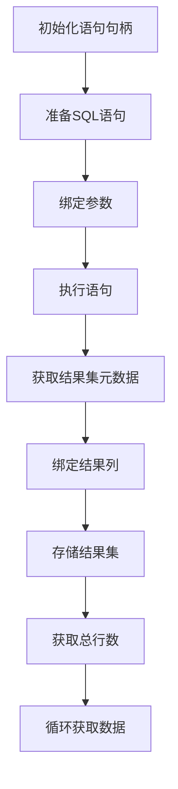
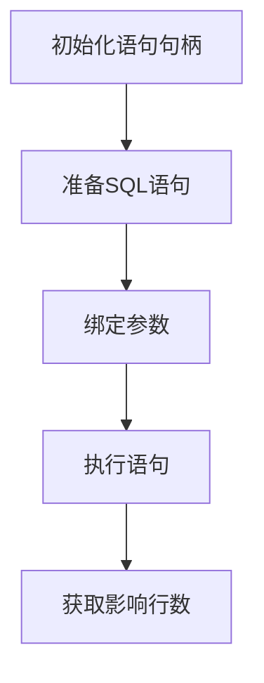

以下是针对 MySQL Prepared Statements 的完整执行顺序指南，区分了 SELECT 查询和 INSERT/UPDATE/DELETE 操作：

---

### **一、SELECT 查询操作的正确顺序**


1. **`mysql_stmt_init()`** - 初始化语句句柄  
2. **`mysql_stmt_prepare()`** - 准备 SQL 语句  
3. **`mysql_stmt_bind_param()`** - 绑定输入参数（若有 WHERE 条件）  
4. **`mysql_stmt_execute()`** - 执行查询  
5. **`mysql_stmt_result_metadata()`** - 获取结果集元数据（字段信息）  
6. **`mysql_num_fields()`** - 基于元数据获取字段数量（可选）  
7. **`mysql_stmt_bind_result()`** - 绑定结果列到变量  
8. **`mysql_stmt_store_result()`** - ★关键步骤★ 将结果集缓存到客户端  
9. **`mysql_stmt_num_rows()`** - 获取总行数（依赖 store_result）  
10. **循环 `mysql_stmt_fetch()`** - 逐行获取数据  
11. 关闭句柄和释放资源

> ✅ **关键说明**：  
> - 步骤 8 (`mysql_stmt_store_result`) 必须在步骤 9 (`mysql_stmt_num_rows`) 之前调用，否则无法获取正确行数  
> - 步骤 5 (元数据) 必须在绑定结果列（步骤 7）之前调用

---

### **二、INSERT/UPDATE/DELETE 操作的正确顺序**


1. **`mysql_stmt_init()`** - 初始化语句句柄  
2. **`mysql_stmt_prepare()`** - 准备 SQL 语句  
3. **`mysql_stmt_bind_param()`** - 绑定参数（如 VALUES 或 SET 值）  
4. **`mysql_stmt_execute()`** - 执行操作  
5. **`mysql_stmt_affected_rows()`** - 获取受影响的行数  
6. 关闭句柄

> ✅ **关键说明**：  
> - **禁止调用结果集相关函数**（如 `store_result`, `num_rows`, `bind_result`）  
> - 使用 `mysql_stmt_affected_rows()` 而非 `mysql_stmt_num_rows()`

---

### **三、关键差异总结**
| **步骤**                  | SELECT 查询             | INSERT/UPDATE/DELETE         |
| ------------------------- | ----------------------- | ---------------------------- |
| 绑定参数                  | ✅ 需要 (`WHERE` 条件)   | ✅ 需要 (VALUES/SET)          |
| 结果集元数据              | ✅ 必须                  | ❌ 禁止                       |
| 绑定结果列                | ✅ 必须                  | ❌ 禁止                       |
| `mysql_stmt_store_result` | ✅ 必须（用于行数统计）  | ❌ 禁止                       |
| 行数获取函数              | `mysql_stmt_num_rows()` | `mysql_stmt_affected_rows()` |

---

### **四、完整示例代码**

#### SELECT 查询示例
```c
MYSQL_STMT *stmt = mysql_stmt_init(mysql);
const char *query = "SELECT id, name FROM users WHERE age > ?";
mysql_stmt_prepare(stmt, query, strlen(query));

// 绑定参数
int min_age = 18;
MYSQL_BIND param = {0};
param.buffer_type = MYSQL_TYPE_LONG;
param.buffer = &min_age;
mysql_stmt_bind_param(stmt, &param);

// 执行
mysql_stmt_execute(stmt);

// 处理结果集
MYSQL_RES *meta = mysql_stmt_result_metadata(stmt);
int field_count = mysql_num_fields(meta); // 可选

// 绑定结果列
MYSQL_BIND result[2];
int id;
char name[50];
result[0].buffer_type = MYSQL_TYPE_LONG;
result[0].buffer = &id;
result[1].buffer_type = MYSQL_TYPE_STRING;
result[1].buffer = name;
result[1].buffer_length = sizeof(name);
mysql_stmt_bind_result(stmt, result);

// ★ 缓存结果集 ★
mysql_stmt_store_result(stmt);

// 获取总行数
my_ulonglong row_count = mysql_stmt_num_rows(stmt);
if (row_count == 0) { /* 无数据 */ }

// 逐行获取
while (mysql_stmt_fetch(stmt) == 0) {
    printf("ID: %d, Name: %s\n", id, name);
}

// 清理
mysql_free_result(meta);
mysql_stmt_close(stmt);
```

#### INSERT 操作示例
```c
MYSQL_STMT *stmt = mysql_stmt_init(mysql);
const char *query = "INSERT INTO users (name, age) VALUES (?, ?)";
mysql_stmt_prepare(stmt, query, strlen(query));

// 绑定参数
char name[] = "Alice";
int age = 25;
MYSQL_BIND params[2] = {{0}};
params[0].buffer_type = MYSQL_TYPE_STRING;
params[0].buffer = name;
params[0].buffer_length = strlen(name);
params[1].buffer_type = MYSQL_TYPE_LONG;
params[1].buffer = &age;
mysql_stmt_bind_param(stmt, params);

// 执行
mysql_stmt_execute(stmt);

// 获取影响行数
my_ulonglong affected = mysql_stmt_affected_rows(stmt);
if (affected == 1) { /* 插入成功 */ }

mysql_stmt_close(stmt);
```

---

### **五、易错点提醒**
1. **SELECT 中忘记调用 `mysql_stmt_store_result()`**  
   导致 `mysql_stmt_num_rows()` 始终返回 0  
   
2. **混淆行数函数**  
   - SELECT 用 `num_rows()`  
   - INSERT/UPDATE/DELETE 用 `affected_rows()`  

3. **未获取元数据直接绑定结果**  
   必须通过 `mysql_stmt_result_metadata()` 确定结果集结构后再绑定

4. **非查询操作调用结果集函数**  
   会导致内存错误或未定义行为